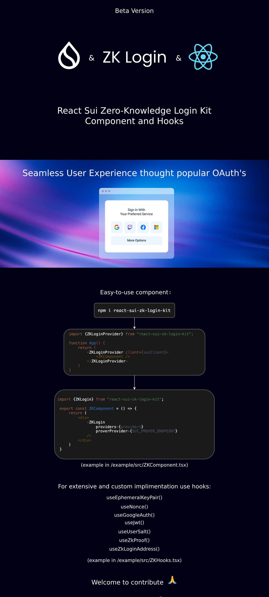

A 🛠️ React hooks library for implementing `zkLogin` 🔐 authentication and transaction flows on the **Sui blockchain**. This library provides modular, reusable hooks to handle ephemeral key management, nonce generation, JWT parsing, ZK proof generation, and more.

### Zk Login Intro [youtube video](https://www.youtube.com/watch?v=60dwcV8Xogg&pp=ygUHemtMb2dpbg%3D%3D)
### What is zkLogin? [youtube video](https://www.youtube.com/watch?v=CZSH9B7j-AY)

---

## ⚡ **Hooks Overview**
> useEphemeralKeyPair - Manages ephemeral key pair lifecycle (generate, access, and clear keys).

> useNonce - Handles nonce and randomness generation for authentication.

> useJwt - Parses and manages JWT payloads (decode and extract information).

> useUserSalt - Manages user salt storage (generate, access, and clear salts).

> useZkLoginAddress - Generates zkLogin addresses from JWT and salt.

> useZkProof - Generates ZK proofs for secure authentication.

> useTransactionExecution - Executes Sui transactions with ZK proofs.

### Todo

- [ ] make zero deps

### In Progress

- [ ] add Twitch OAuth

### Done ✓

- [x] add Google OAuth 
- [x] split up styles
- [x] add hooks
- [x] add component